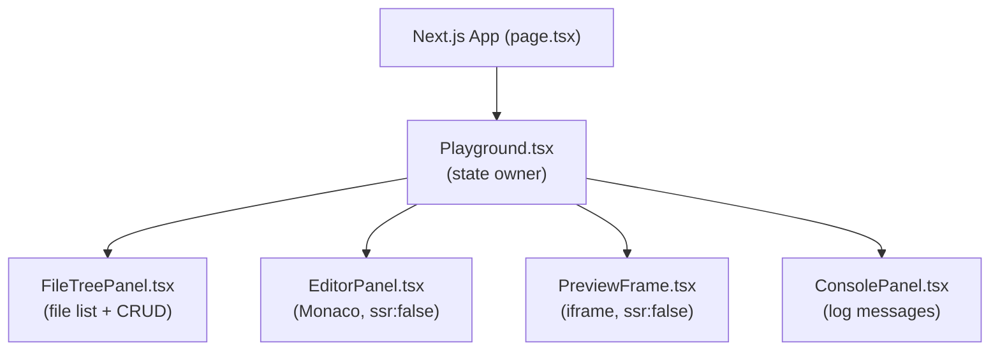
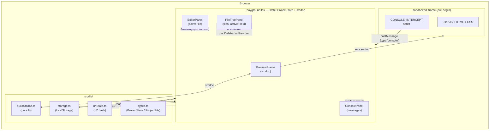
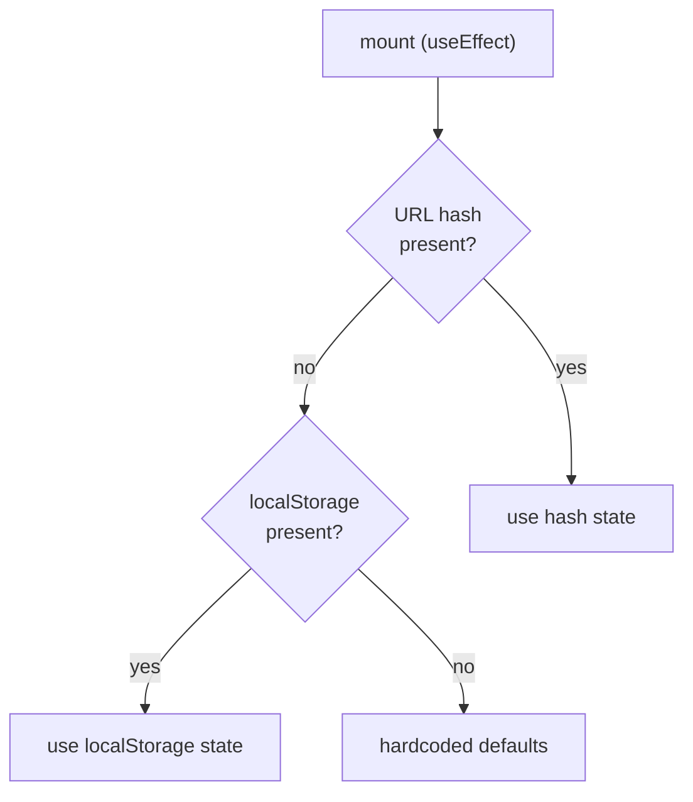
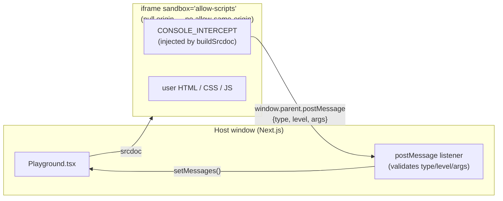

# Webpad Architecture

## Component Tree

## Data Flow

## State Hydration Order

## iframe Isolation Model

## Key Files

| Path | Role |
|---|---|
| `src/app/page.tsx` | Next.js route — renders `<Playground />` |
| `src/components/Playground.tsx` | Single state owner; wires all panels |
| `src/components/EditorPanel.tsx` | Monaco editor (one instance, swaps file on tab change) |
| `src/components/PreviewFrame.tsx` | Renders sandboxed `<iframe srcdoc>` |
| `src/components/ConsolePanel.tsx` | Displays postMessage logs from iframe |
| `src/components/FileTreePanel.tsx` | File list with create / rename / delete / drag-reorder |
| `src/lib/buildSrcdoc.ts` | Pure fn: assembles HTML+CSS+JS into an srcdoc string |
| `src/lib/storage.ts` | Read/write `ProjectState` to `localStorage` |
| `src/lib/urlState.ts` | LZ-compress state into/from URL hash |
| `src/lib/types.ts` | `ProjectFile`, `ProjectState`, migration helpers |
